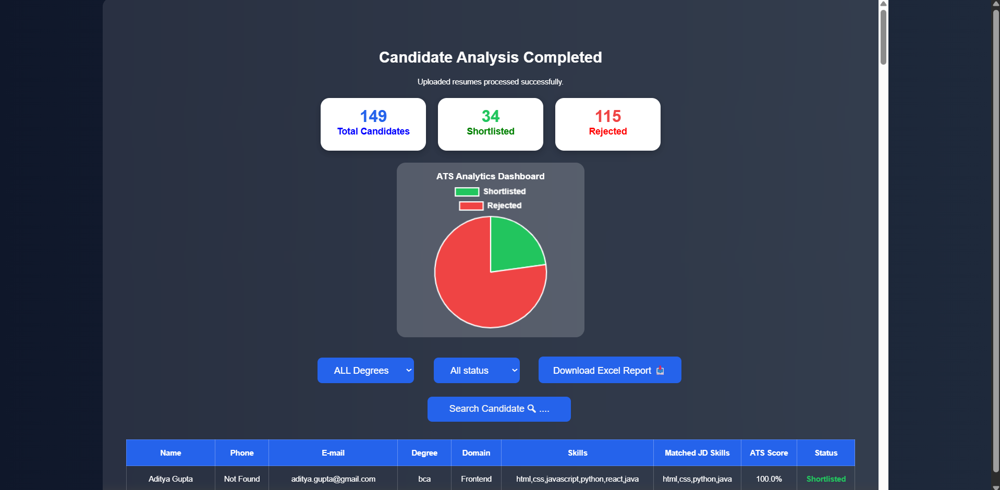

# TechHire ATS – Dynamic JD-Based Recruitment System

## Overview

TechHire ATS is a web-based Applicant Tracking System (ATS) developed using Python, Flask, and SQLite. The system automates resume screening by matching candidate resumes against recruiter-provided Job Descriptions (JD) and calculating ATS scores.

## Features

* Dynamic Job Description Matching
* Resume Parsing from PDF
* ATS Score Calculation
* Candidate Shortlisting & Rejection
* Search and Filter Candidates
* Dashboard Analytics
* Excel Report Download
* Login & Authentication System


## Tech Stack

* Python
* Flask
* SQLite
* HTML
* CSS
* JavaScript
* OpenPyXL

## How It Works

1. Recruiter enters a Job Description.
2. Uploads one or multiple resumes.
3. System extracts candidate details and skills.
4. ATS score is calculated based on JD matching.
5. Candidates are shortlisted or rejected automatically.

## Project Structure

```text
Smart ATS Recruitment System/
│
├── app.py
├── templates/
├── static/
├── uploads/
├── utils/
└── ats.db
```
## Project Screenshot



## Future Enhancements

* AI-based resume ranking
* Email notifications
* Interview scheduling
* Advanced analytics dashboard

## Author

**Sohail Ishak Kalut**  
MCA Student | Python Developer  
GitHub: https://github.com/sohailkalut123-beep
